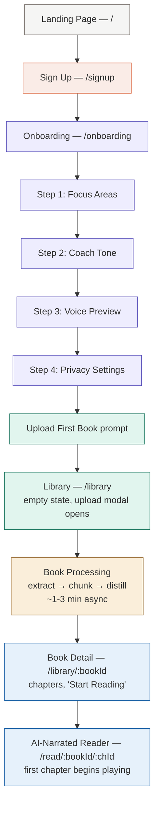
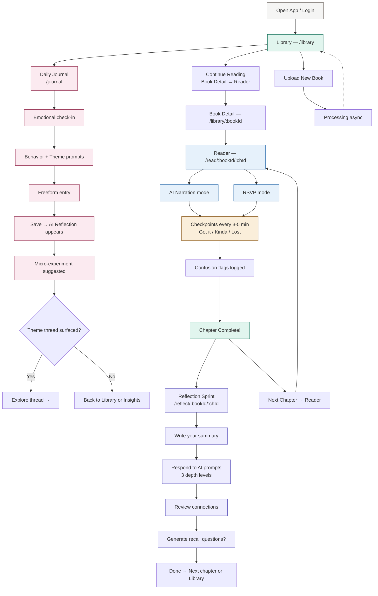
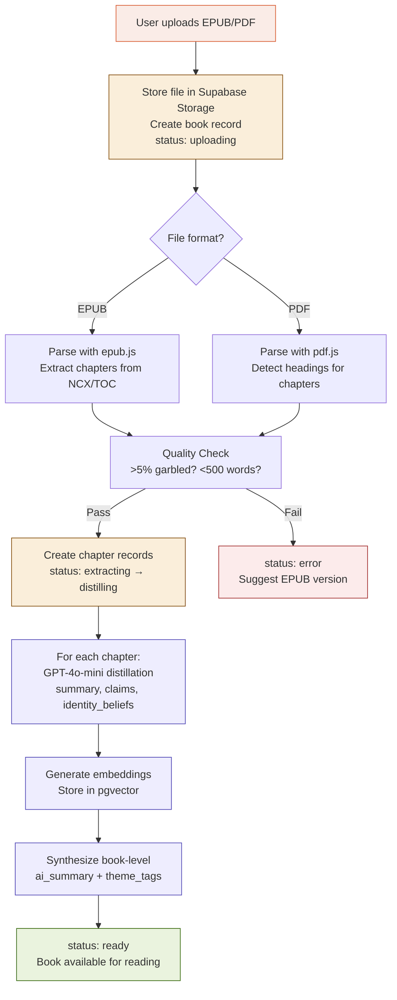
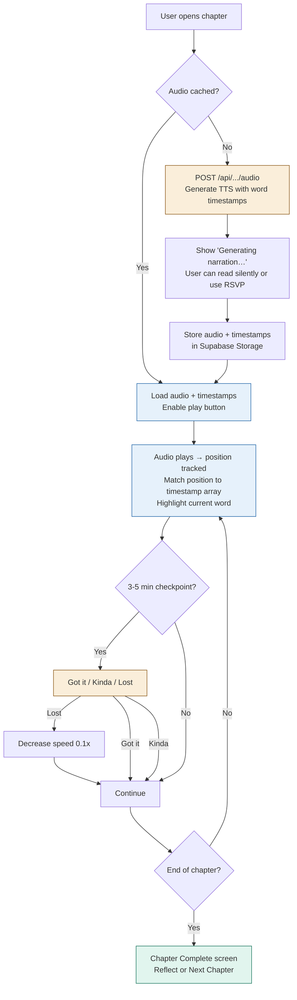
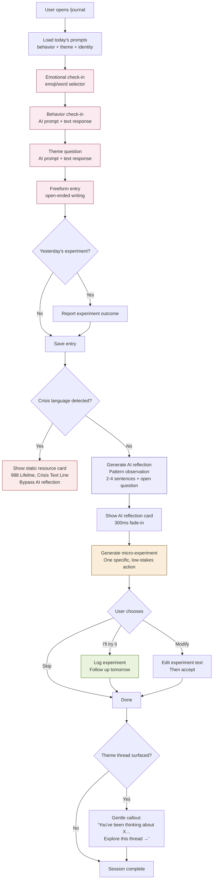

# ReadFlow — User Flow Diagrams

---

## 1. New User Flow (First Visit → First Reading Session)



### Time Estimates
| Step | Duration |
|------|----------|
| Sign up | ~30 seconds |
| Onboarding (4 steps) | ~2 minutes |
| Book processing | ~1–3 minutes (async) |
| **Total to first value** | **~5 minutes** |

### Key Design Decisions
- Onboarding defaults to narration mode (not RSVP)
- Upload modal opens automatically on first visit to library
- Book processing happens async — user sees progress badge on book card
- If audio isn't cached yet when user opens reader, show "Generating narration…" with option to switch to RSVP

---

## 2. Returning User Flow (Daily Session)



### Session Patterns

**Quick session (10 min):** Library → Journal check-in → Done

**Standard session (30 min):** Library → Reader (1 chapter) → Reflection Sprint → Done

**Deep session (60+ min):** Journal → Reader (2–3 chapters) → Reflection → Insights review

---

## 3. Book Processing Pipeline Flow



---

## 4. AI Narration & Word Highlighting Flow



---

## 5. Daily Journal AI Reflection Flow



---

## 6. Navigation Map

```mermaid
flowchart LR
    LANDING[/ Landing] --> SIGNUP[/signup]
    LANDING --> LOGIN[/login]
    SIGNUP --> ONBOARD[/onboarding]
    LOGIN --> LIBRARY[/library]
    LOGIN --> ONBOARD
    ONBOARD --> LIBRARY
    
    LIBRARY --> DETAIL[/library/:bookId]
    LIBRARY --> JOURNAL[/journal]
    LIBRARY --> INSIGHTS[/insights]
    LIBRARY --> SETTINGS[/settings]
    
    DETAIL --> READER[/read/:bookId/:chId]
    DETAIL --> REFLECT[/reflect/:bookId/:chId]
    
    READER --> REFLECT
    READER --> READER
    REFLECT --> READER
    REFLECT --> DETAIL
    REFLECT --> LIBRARY

    style LANDING fill:#f5f5f4,stroke:#78716c
    style LIBRARY fill:#e1f5ee,stroke:#0f6e56
    style READER fill:#e6f1fb,stroke:#185fa5
    style REFLECT fill:#eeedfe,stroke:#534ab7
    style JOURNAL fill:#fbeaf0,stroke:#993556
    style INSIGHTS fill:#faeeda,stroke:#854f0b
```

### Sidebar Navigation (persistent on authenticated pages)
| Icon | Label | Route |
|------|-------|-------|
| book-open | Library | /library |
| pen-line | Journal | /journal |
| bar-chart-3 | Insights | /insights |
| settings | Settings | /settings |

Sidebar collapses to icons on mobile. On the reader page, the sidebar is hidden entirely for distraction-free experience. Mobile uses a bottom tab bar instead.
